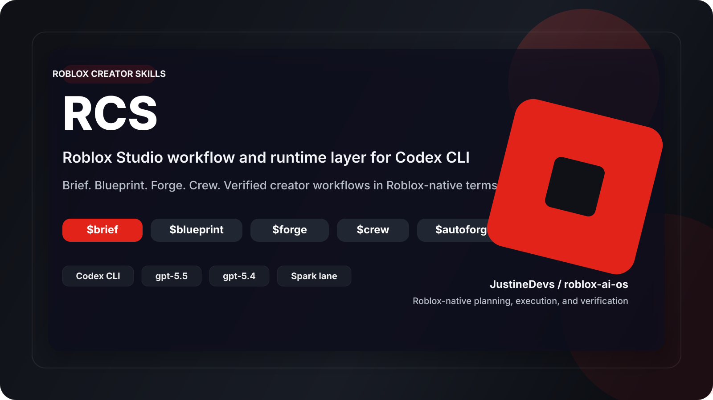

<p align="center">
  
</p>

<p align="center">
  <a href="https://www.roblox.com/create">
    
  </a>
  <a href="https://github.com/JustineDevs/roblox-ai-os/stargazers">
    
  </a>
  <a href="https://github.com/JustineDevs/roblox-ai-os/forks">
    
  </a>
  <a href="https://www.npmjs.com/package/@jstn-sdk/rcs">
    
  </a>
</p>

RCS is a Roblox Studio operating layer for [OpenAI Codex CLI](https://github.com/openai/codex): it gives serious Roblox creators one disciplined workflow for briefing, planning, building, reviewing, and verifying creator work in Roblox-native terms. It is owned by **[@JustineDevs](https://github.com/JustineDevs)** and ships creator-oriented briefing, blueprinting, forging, crew execution, and psychology-aware design workflows on top of Codex.

**Package:** `@jstn-sdk/rcs`  
**Repo:** `https://github.com/JustineDevs/roblox-ai-os`  
**Docs:** [Getting Started](./docs/getting-started.html) · [Skills](./docs/skills.html) · [Agents](./docs/agents.html) · [Contributor wiki](./docs/wiki/Home.md) · [Integrations](./docs/integrations.html) · [Notification Gateway and OpenClaw guide](./docs/openclaw-integration.md) · [Agentic platform compatibility](./docs/reference/agentic-platform-compatibility.md)

> [!WARNING]
> Recommended default: macOS or Linux with Codex CLI.
> RCS is primarily designed and actively tuned for that path.
> Native Windows and Codex App are not the default experience, may break or behave inconsistently, and currently receive less support.

## Agentic IDE support matrix

RCS separates **what we author once** (canonical `skills/`, prompts, catalog, templates) from **how each host consumes it**. See [Agentic platform compatibility](./docs/reference/agentic-platform-compatibility.md) and the machine-readable registry [`src/platform-targets/manifest.json`](./src/platform-targets/manifest.json).

| Tier | Hosts | What you get today |
|------|--------|-------------------|
| **Tier 1 — Recommended** | **Codex CLI** on macOS or Linux with `rcs setup` | Full runtime: installed skills and prompts, managed native hooks, generated Codex agents where applicable, `.rcs/` state, and the normal `$brief` / `$forge` / `$crew` workflow surface. |
| **Tier 2 — Planned delivery** | **Cursor**, **MCP-first editors**, **Claude-like** assistants (e.g. Claude Code) | Canonical Roblox creator **skills** and **AGENTS-style** orchestration stay in this repo as [SSOT](./docs/plugin-bundle-ssot.md). **Concrete emitters** for those hosts are **planned lanes** (`cursor`, `mcp-capable-ide`, `claude-like` in the manifest)—track releases for the first shipped path per host class. |
| **Tier 3 — Adapters today** | **OpenClaw**, **Hermes** | RCS-owned **adapter** surfaces under [`src/adapt/`](./src/adapt/) for notifications, gateways, and observation—**not** a drop-in replacement for Tier 1 Codex runtime semantics. |

**Windows vs CI:** GitHub Actions runs the primary Node test gate on **Linux**. A full local `npm test` on **native Windows** may still fail on path- or tool-specific tests unrelated to your feature work; prefer **Linux or WSL2** when verifying a release line, or run the same scoped commands your PR checks use.

**npm install vs git clone:** The published `@jstn-sdk/rcs` package tarball does **not** include [`corpora/`](./corpora/README.md) (security datasets). Clone the repository when you need those paths or contributor corpora docs.

It keeps Codex as the execution engine and makes it easier to:
- start a stronger Codex session by default
- run one consistent workflow from briefing to execution handoff
- invoke creator-facing workflows with `$brief`, `$blueprint`, `$crew`, `$forge`, and `$autoforge`
- design Roblox loops from player desire backward with psychology-aware commands for audience, motivation, progression, status, FOMO, mastery, community, retention, and LiveOps
- force Roblox work through a mandatory pre-action gate before any code generation or refactor
- keep project guidance, plans, logs, and state in `.rcs/`

## Strict setup

> [!IMPORTANT]
> Do this in order. Do not skip the smoke test.

### Requirements

- Node.js 20+
- Codex CLI installed
- Codex auth visible in the same shell/profile that will run RCS
- `tmux` on macOS/Linux if you want the recommended durable runtime
- `psmux` on native Windows only if you intentionally want the less-supported Windows team path

### 1. Install Codex and RCS

```bash
npm install -g @openai/codex @jstn-sdk/rcs
```

What it does:
- installs Codex CLI
- installs the RCS runtime/CLI layer
- does **not** fully wire the local runtime yet

### 2. Run setup

```bash
rcs setup
```

What it does:
- installs prompts, skills, and AGENTS scaffolding
- wires `.codex/config.toml`
- installs RCS-managed native Codex hooks
- keeps runtime state under `.rcs/`

On a real RCS version bump, the global npm install prints an explicit reminder instead of auto-running setup. If you want npm update + setup refresh in one step later, use `rcs update`.

Blunt latest-version triggers:

```bash
npm install -g @jstn-sdk/rcs@latest
rcs update
rcs latest
rcs @latest
```

What they do:
- `npm install -g @jstn-sdk/rcs@latest` pulls the newest published package directly
- `rcs update` checks npm now, installs `@latest`, then refreshes setup
- `rcs latest` and `rcs @latest` are explicit aliases for the same update path

### 3. Run doctor

```bash
rcs doctor
```

What it does:
- checks that RCS files, hooks, config, and runtime prerequisites are present
- catches bad local setup shape early
- does **not** prove that Codex can make a real authenticated model call

### 4. Run the real smoke test

```bash
codex login status
rcs exec --skip-git-repo-check -C . "Reply with exactly RCS-EXEC-OK"
```

What it does:
- `codex login status` confirms the active profile is authenticated
- `rcs exec ...` proves the current shell/profile can actually complete a live Codex request
- catches proxy/auth/base-URL/profile problems that `rcs doctor` alone cannot prove

### 5. Launch RCS the recommended way

```bash
rcs --madmax --high
```

What it does:
- starts the main RCS runtime on the recommended strong path
- on macOS/Linux with `tmux`, prefers the durable detached runtime/HUD path
- gives you the normal creator workflow surface on top of Codex

### 6. Work through the canonical creator path

```text
$brief "clarify the creator workflow change"
$blueprint "approve the plan and review tradeoffs"
$forge "carry the approved plan to completion"
$crew "execute the approved plan in parallel"
$autoforge "take a scoped creator workflow from brief to ship-ready outputs"
```

What it does:
- `$brief` clarifies the ask
- `$blueprint` approves the plan
- `$forge` carries one-owner execution to verified completion
- `$crew` handles coordinated parallel execution
- `$autoforge` runs the end-to-end creator flow with minimal supervision

That is the main path.

> [!NOTE]
> This repo also ships an official Codex plugin layout at `plugins/roblox-ai-os-creator-skills` with marketplace metadata in `.agents/plugins/marketplace.json`.
> That plugin bundles the mirrored skill surface plus plugin-scoped companion metadata for MCP servers and apps.
> Native/runtime hooks still stay on the setup/runtime side rather than the installable plugin manifest.
> It is still **not** a replacement for `npm install -g @jstn-sdk/rcs` plus `rcs setup`.

> [!IMPORTANT]
> **MCP activation split**
>
> After `rcs setup`, the default Codex-compatible config should include two MCP layers:
>
> 1. **First-party RCS MCP servers** via `rcs mcp-serve`
>    - `rcs_state`
>    - `rcs_memory`
>    - `rcs_code_intel`
>    - `rcs_trace`
>    - `rcs_wiki`
>
> 2. **Default Roblox reference MCP servers** via GitMCP remote transport
>    - `creator_docs`
>    - `roblox_skills`
>    - `devprod_docs`
>    - `roblox_scripts_corpus`
>
> Recommended activation model:
> - keep **first-party `rcs mcp-serve`** active for local runtime/state/control-plane work
> - keep the **GitMCP Roblox reference servers** active by default to reduce hallucination and improve Roblox platform grounding
> - enable **`robloxstudio-mcp`** manually only when you want a live Codex CLI <-> Roblox Studio connection
>
> Important clarification:
> - `rcs mcp-serve` is only for **RCS-owned local MCP servers**
> - it does **not** serve `robloxstudio-mcp`
> - `robloxstudio-mcp` remains an explicit opt-in live Studio bridge because it requires a Studio plugin, HTTP enabled in Studio, and a higher-trust write boundary
> - for plugin install/activation steps, follow the upstream `robloxstudio-mcp` guide first; RCS compatibility docs do **not** replace the upstream setup instructions

## Who RCS is for

Use RCS if you are:
- a Roblox Studio developer building live experiences, gameplay systems, UI, persistence, remotes, or creator tooling
- a technical Roblox creator who wants Codex to work through one stricter Roblox-native workflow instead of generic coding prompts
- a plugin or tool author working on Studio-adjacent workflows
- a small advanced team that wants structured AI coordination for creator work

RCS is best for people who already like Codex but want:
- one standard creator workflow built around `$brief`, `$blueprint`, `$crew`, `$forge`, and `$autoforge`
- a structured player-psychology design layer for retention, motivation, social stickiness, and monetization fit
- specialist roles and supporting skills when the task needs them
- project guidance through scoped `AGENTS.md`
- durable state under `.rcs/` for plans, logs, memory, and mode tracking

RCS is probably not for you if you want:
- plain Codex with no extra workflow layer
- a generic web or SaaS development framework
- a beginner-friendly Roblox Studio teaching product

## Contributor onramp

RCS should be easy to understand, run, and improve.

Contributor entry points:
- [Contributor wiki](./docs/wiki/Home.md)
- [Good first issues and labels](./docs/wiki/Good-First-Issues.md)
- [Roadmap](./docs/wiki/Roadmap.md)
- [Contributing](./CONTRIBUTING.md)

Maintainer standards:
- label small, safe tasks with `good first issue` and broader open tasks with `help wanted`
- keep issues granular enough to finish without deep repo archaeology
- accept docs, localization, QA, wiki, triage, and release-note contributions as first-class work
- keep review and response loops respectful, fast, and actionable
- acknowledge contributors in release notes, docs, or acknowledgements when their work lands
- follow an All Contributors-style mindset: documentation, design, translation, QA, and triage work count too

The contributor wiki is a public project surface. It is **not** the same as the local runtime wiki under `.rcs/wiki/`.

## A simple mental model

RCS does **not** replace Codex.

It adds a better working layer around it:
- **Codex** does the actual agent work
- **RCS role keywords** make useful roles reusable
- **RCS skills** make common workflows reusable
- **`.rcs/`** stores plans, logs, memory, and runtime state

Most users should think of RCS as **better task routing + better workflow + better runtime**, not as a command surface to operate manually all day.

## Multi-agent compatibility core

RCS uses a registry-driven multi-agent architecture, but in this repo the core is split across:
- native role definitions in `src/agents/definitions.ts`
- catalog/install policy in `src/agents/policy.ts` and `src/catalog/manifest.json`
- native Codex TOML generation in `src/agents/native-config.ts`
- external adapter targets in `src/adapt/*`

If you are changing that layer, use the architecture reference instead of assuming an external `src/agents.ts` example applies here:
- [Multi-agent compatibility architecture](./docs/reference/multi-agent-compatibility-architecture.md)

## Sharp positioning

RCS is the Roblox-native workflow and runtime layer for Codex CLI.

It helps advanced Roblox creators move from creator brief -> approved blueprint -> verified implementation without drifting into generic web-app language, ungrounded code generation, or weak verification.

## Recommended workflow

1. `$brief` — clarify scope when the request or boundaries are still vague.
2. `$blueprint` — turn that clarified scope into an approved architecture and implementation plan.
3. `$crew` or `$forge` — use `$crew` for coordinated parallel execution, or `$forge` when you want a persistent completion loop with one owner.

## Launch policy notes

On macOS/Linux interactive terminals with `tmux` available, `rcs --madmax --high` starts the leader in the RCS-managed detached tmux path by default so the HUD/runtime panes can be created and recovered.

If you want a one-off launch with no RCS tmux/HUD management, use:

```bash
rcs --direct --yolo
```

For a persistent shell/profile preference:

```bash
RCS_LAUNCH_POLICY=direct rcs --yolo
unset RCS_LAUNCH_POLICY
```

Use `RCS_LAUNCH_POLICY=direct|tmux|detached-tmux|auto`. CLI policy flags win over the environment, and the last CLI policy flag before `--` wins.

## Roblox Pre-Action Gate

RCS does not allow Roblox implementation to begin from memory or improvisation. Before any Roblox code generation, asset logic, UI system, monetization design, plugin work, or refactor, the workflow must first:

1. gather Roblox references
2. synthesize understanding
3. standardize official terms
4. design modular architecture and file tree
5. then implement

The required planning shape is documented in:
- [Roblox Pre-Action Protocol](./docs/reference/roblox-pre-action-protocol.md)
- [Roblox Pre-Action Plan Template](./templates/roblox/pre-action-plan.md)

`PRE_ACTION_COMPLETE` must be `true` before Roblox code generation is allowed.

## Psychology-aware workflow

RCS v0.1.0 adds a formal player-psychology layer for Roblox experience design. The system is behavior-first: define player desire, loop tension, social fit, progression pressure, and monetization guardrails before building feature count.

### Briefing surfaces

```text
$brief:audience "farming simulator for short mobile sessions"
$brief:motivation "anime battler with collection, flex, and co-op raid goals"
```

### Blueprint surfaces

```text
$blueprint:psych "social roleplay town with repeat visits and identity expression"
$blueprint:loop "define session, daily, weekly, and comeback loops for a tycoon"
$blueprint:retention "plan D1/D7/D30 assumptions for a pet collection simulator"
$blueprint:social "turn a hangout game into a social machine"
```

### Forge surfaces

```text
$forge:reward-loop "reward spec for a farming loop with escalation and fail states"
$forge:daily-loop "daily return plan for a creature collector"
$forge:event-loop "limited-time summer event with urgency and re-entry logic"
$forge:progression "progression ladder for a rebirth-heavy simulator"
$forge:status "prestige and flex systems for a social roleplay game"
$forge:fomo "fair urgency mechanics for a seasonal shop"
$forge:mastery "skill-expression systems for a combat tactics game"
$forge:community "social retention systems for guild, co-op, and party play"
```

The canonical framework covers five drivers:

1. Progression
2. Status
3. FOMO
4. Mastery
5. Community

Each driver is evaluated through player desire, mechanic patterns, UI feedback, economy effects, retention effects, monetization fit, abuse risk, and Roblox fit.

## Common in-session surfaces

| Surface | Use it for |
| --- | --- |
| `$brief "..."` | clarifying intent, boundaries, and non-goals |
| `$brief:audience "..."` | target fantasy, session habits, pain/desire language, and return motive |
| `$brief:motivation "..."` | dominant psychology drivers and anti-pattern risks |
| `$blueprint "..."` | approving the implementation plan and tradeoffs |
| `$blueprint:psych "..."` | player psychology blueprint from desire backward |
| `$blueprint:loop "..."` | session/daily/weekly/comeback loop design |
| `$blueprint:retention "..."` | D1/D7/D30 assumptions, cadence, and comeback hooks |
| `$blueprint:social "..."` | party/trade/guild/co-op/social-presence design |
| `$forge "..."` | persistent completion and verification loops |
| `$forge:reward-loop "..."` | concrete reward-loop specs |
| `$forge:daily-loop "..."` | return motivator specs |
| `$forge:event-loop "..."` | event and urgency structures |
| `$forge:progression "..."` | XP/level/prestige/rebirth ladders |
| `$forge:status "..."` | visible prestige/flex systems |
| `$forge:fomo "..."` | fair urgency mechanics with anti-frustration guardrails |
| `$forge:mastery "..."` | skill-expression and optimization systems |
| `$forge:community "..."` | social stickiness systems |
| `$crew "..."` | coordinated parallel execution when the work is big enough |
| `$autoforge "..."` | end-to-end creator workflow with minimal supervision |
| `/skills` | browsing installed skills and supporting helpers |

## Advanced creator operations

These are supporting operator interfaces, not the main onboarding path.

### Coordinated execution

Use `rcs team` only when the approved creator plan genuinely needs durable tmux/worktree coordination. The default creator flow remains `$brief -> $blueprint -> $forge / $crew -> $autoforge`.

```bash
rcs team 3:executor "fix the failing tests with verification"
rcs team status <team-name>
rcs team resume <team-name>
rcs team shutdown <team-name>
```

### Setup, doctor, and HUD

These are operator/support surfaces:
- Codex plugin marketplace install/discovery can cache the plugin under `${CODEX_HOME:-~/.codex}/plugins/cache/$MARKETPLACE_NAME/roblox-ai-os-creator-skills/$VERSION/` (local installs may use `local` as the version identifier); that packaged plugin includes plugin-scoped companion metadata for MCP servers and apps, while native/runtime hooks remain setup-owned, so it is still not the full RCS runtime setup
- Plugin install/discovery is not a replacement for `npm install -g @jstn-sdk/rcs` plus `rcs setup`; legacy setup mode installs native agents/prompts, and plugin setup mode archives stale legacy prompt/native-agent files before relying on plugin discovery for bundled skills.
- `rcs setup` installs prompts, skills, AGENTS scaffolding, `.codex/config.toml`, and RCS-managed native Codex hooks in `.codex/hooks.json`
  - setup refresh preserves non-RCS hook entries in `.codex/hooks.json` and only rewrites RCS-managed wrappers
  - `rcs setup --merge-agents` preserves existing `AGENTS.md` guidance while inserting or refreshing generated RCS sections between `<!-- RCS:AGENTS:START -->` / `<!-- RCS:AGENTS:END -->`; without `--merge-agents` or `--force`, non-interactive setup keeps skipping existing `AGENTS.md` files
  - `rcs uninstall` removes RCS-managed wrappers from `.codex/hooks.json` but keeps the file when user hooks remain
- `rcs update` checks npm immediately, installs the newest global RCS build, then reruns the same interactive setup refresh path
- fresh RCS-managed `gpt-5.5` config seeding now recommends `model_context_window = 250000` and `model_auto_compact_token_limit = 200000`, but only when those keys are missing
- `.rcs-config.json` model/env routing is documented in [the model/env routing reference](./docs/reference/rcs-config-schema-routing.md); only edit keys supported by your installed RCS version
- `rcs doctor` verifies the install when something seems wrong; it does not prove that the active Codex profile can make an authenticated model call
- `rcs hud --watch` is a monitoring/status surface, not the primary user workflow

For non-team sessions, native Codex hooks are now the canonical lifecycle surface:
- `.codex/hooks.json` = native Codex hook registrations
- `.rcs/hooks/*.mjs` = RCS plugin hooks
- `rcs tmux-hook` / notify-hook / derived watcher = tmux + runtime fallback paths

See [Codex native hook mapping](./docs/codex-native-hooks.md) for the current native / fallback matrix.


### Troubleshooting false-green readiness

A green `rcs doctor` means the install and local runtime wiring look sane. If real execution still fails, check the environment Codex actually uses:

- Run `codex login status` and `rcs exec --skip-git-repo-check -C . "Reply with exactly RCS-EXEC-OK"` from the same shell/profile that will launch RCS.
- In custom HOME, profile, container, or service shells, confirm the active `~/.codex` (or `CODEX_HOME`) is the one with the expected auth and config. Do not assume your normal user `~/.codex` is visible there.
- If you depend on a local OpenAI-compatible proxy, confirm the active `~/.codex/config.toml` includes the expected `openai_base_url`; otherwise a proxy-issued key can be sent to the default endpoint and fail with `401 Unauthorized`, `Missing bearer or basic authentication in header`, or `Incorrect API key provided`.
- If `rcs doctor --team` or resume reports a stale team such as `resume_blocker` or a missing tmux session, clean the dead runtime state before retrying:

```bash
rcs team shutdown <team-name> --force --confirm-issues
rcs cancel
rcs doctor --team
```

Only use the forced team shutdown for a team you have confirmed is dead or intentionally abandoned.

If `Shift+Enter` still submits instead of inserting a newline inside an RCS-managed tmux session, see [Troubleshooting execution readiness](./docs/troubleshooting.md#shiftenter-submits-instead-of-inserting-a-newline-in-tmux-backed-rcs-sessions). Current RCS already enables tmux extended-key forwarding around its own Codex launch paths, so a persistent failure is usually a tmux terminal-capability/discoverability problem rather than a net-new RCS feature gap.

### Explore and sparkshell

- `rcs explore --prompt "..."` is for read-only repository lookup
- `rcs sparkshell <command>` is for shell-native inspection and bounded verification
- when `.rcs/wiki/` exists, `rcs explore` can inject wiki-first context before falling back to broader repository search
- fallback boundaries are explicit: sparkshell-backend fallback is reported on stderr, and spark-model fallback emits stderr metadata plus an `## RCS Explore fallback` notice in stdout so users can see when cost/behavior may differ from the low-cost path

Examples:

```bash
rcs explore --prompt "find where team state is written"
rcs sparkshell git status
rcs sparkshell --tmux-pane %12 --tail-lines 400
```

### Wiki

- `rcs wiki` is the CLI parity surface for the RCS wiki MCP server
- wiki data lives locally under `.rcs/wiki/`
- the wiki is markdown-first and search-first, not vector-first

Examples:

```bash
rcs wiki list --json
rcs wiki query --input '{"query":"session-start lifecycle"}' --json
rcs wiki lint --json
rcs wiki refresh --json
```

### Platform notes for coordinated execution

`rcs team` is a tmux runtime / CLI runtime surface and works best on macOS/Linux with `tmux`.
From Codex App or outside tmux, treat `rcs team` as an attached-shell runtime rather than an in-process fallback.
If the current surface is outside tmux or Codex App-native, `rcs team` is not directly available; launch RCS CLI from shell first.
Native Windows remains a secondary path, and WSL2 is generally the better choice if you want a Windows-hosted setup.
On native Windows, RCS accepts `psmux` as the tmux-compatible binary for the existing tmux-backed paths it already uses.

| Platform | Install |
| --- | --- |
| macOS | `brew install tmux` |
| Ubuntu/Debian | `sudo apt install tmux` |
| Fedora | `sudo dnf install tmux` |
| Arch | `sudo pacman -S tmux` |
| Windows | `winget install psmux` |
| Windows (WSL2) | `sudo apt install tmux` |

## Known issues

### Intel Mac: high `syspolicyd` / `trustd` CPU during startup

On some Intel Macs, RCS startup — especially with `--madmax --high` — can spike `syspolicyd` / `trustd` CPU usage while macOS Gatekeeper validates many concurrent process launches.

If this happens, try:
- `xattr -dr com.apple.quarantine $(which rcs)`
- adding your terminal app to the Developer Tools allowlist in macOS Security settings
- using lower concurrency (for example, avoid `--madmax --high`)

## Documentation

- [Getting Started](./docs/getting-started.html)
- [Demo guide](./DEMO.md)
- [Wiki feature](./docs/wiki-feature.md)
- [Contributor wiki home](./docs/wiki/Home.md)
- [Contributor roadmap](./docs/wiki/Roadmap.md)
- [Good first issues and labels](./docs/wiki/Good-First-Issues.md)
- [Agent catalog](./docs/agents.html)
- [Multi-agent compatibility architecture](./docs/reference/multi-agent-compatibility-architecture.md)
- [Skills reference](./docs/skills.html)
- [Codex native hook mapping](./docs/codex-native-hooks.md)
- [Integrations](./docs/integrations.html)
- [Troubleshooting execution readiness](./docs/troubleshooting.md)
- [Notification Gateway and OpenClaw guide](./docs/openclaw-integration.md)
- [Contributing](./CONTRIBUTING.md)
- [Changelog](./CHANGELOG.md)

## Languages

- [English](./README.md)
- [한국어](./docs/readme/README.ko.md)
- [日本語](./docs/readme/README.ja.md)
- [简体中文](./docs/readme/README.zh.md)
- [繁體中文](./docs/readme/README.zh-TW.md)
- [Tiếng Việt](./docs/readme/README.vi.md)
- [Español](./docs/readme/README.es.md)
- [Português](./docs/readme/README.pt.md)
- [Русский](./docs/readme/README.ru.md)
- [Türkçe](./docs/readme/README.tr.md)
- [Deutsch](./docs/readme/README.de.md)
- [Français](./docs/readme/README.fr.md)
- [Italiano](./docs/readme/README.it.md)
- [Ελληνικά](./docs/readme/README.el.md)
- [Polski](./docs/readme/README.pl.md)
- [Українська](./docs/readme/README.uk.md)

## Ownership

RCS is owned and maintained by [JustineDevs](https://github.com/JustineDevs) for Roblox creator workflows.

## Acknowledgements

- [OpenAI Codex CLI](https://github.com/openai/codex) for the underlying agent runtime RCS is built on top of.
- [oh-my-codex](https://github.com/Yeachan-Heo/oh-my-codex) for serving as an important stepping stone in the broader workflow/runtime direction behind this project.
- [robloxstudio-mcp](https://github.com/boshyxd/robloxstudio-mcp) for the optional live Roblox Studio MCP connection standard adopted as a compatibility lane in this project.

## License

[MIT](https://opensource.org/licenses/MIT)
